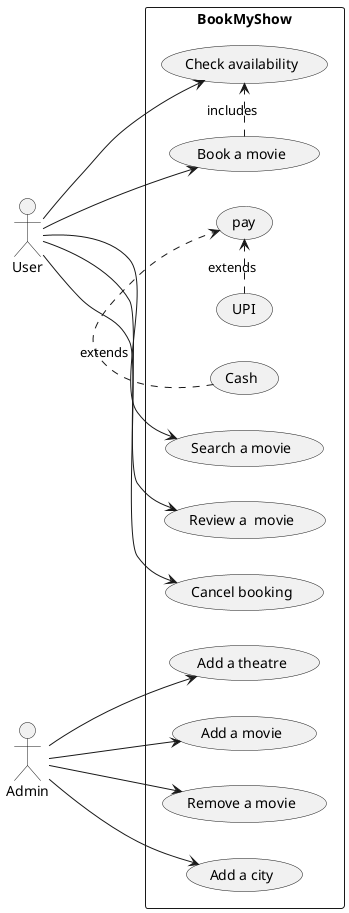
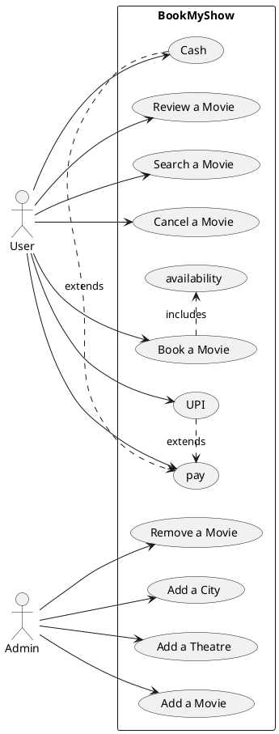
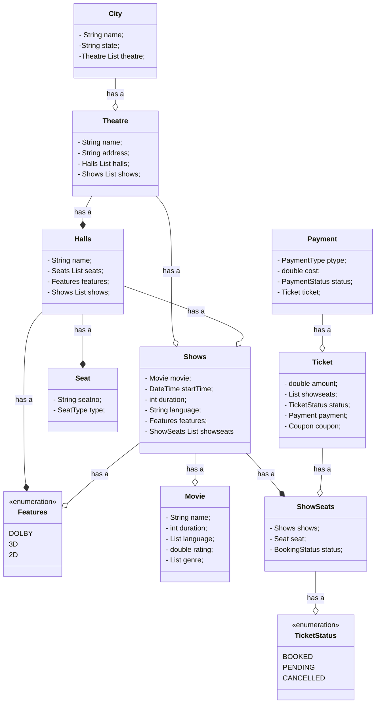

# Use Case Diagram for Book My Show
```
##Actors
-> User
-> Admin
```



# Another simpler way to make use case diagram as shown below:



# Class Diagram of Book My Show
```
# Class
Cities
Theatre
Halls
Movie
Seats
Shows
Tickets
Coupon
```

