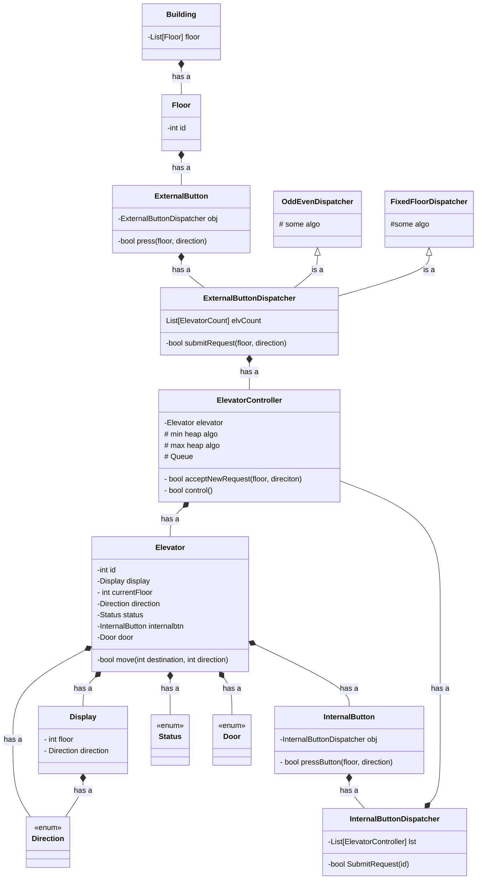

### Class
```
Building
Floor
ExternalButton
ExternalButtonDispatcher
OddEvenDispatcher
FixedFloorDispatcher
ElevatorController
Elevator
Display
InternalButton
InternalButtonDispatcher

```

### Methods/Functions
```

```

## Class diagram of Elevator system
