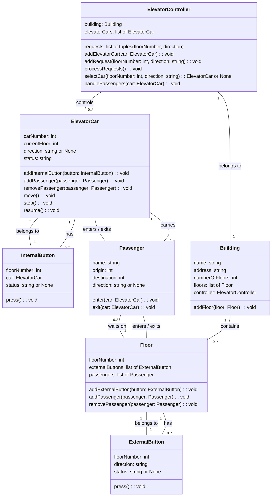

```
Parking lot design:

ParkingLot: Represents a parking lot that contains parking floors and parking gates. It has attributes such as name, address, parkingFloors, entryGates and exitGates. It has behaviors such as addParkingFloor, addEntryGate, addExitGate, getAvailableSpots, issueTicket and processPayment.
ParkingFloor: Represents a parking floor that contains parking spots. It has an attribute such as floorNumber and parkingSpots. It has behaviors such as addParkingSpot and getAvailableSpots.
ParkingSpot: Represents a parking spot that can fit a certain type of vehicle and can be occupied or free. It has attributes such as spotNumber, spotType, status and ticket. It has behaviors such as isFree, canFit, occupy and free.
ParkingTicket: Represents a parking ticket that is issued to a vehicle when it enters the parking lot and is used to calculate the amount to be paid when it exits. It has attributes such as ticketID, spot, vehicle, entryTime, entryGate, entryOperator and invoice.
Invoice: Represents an invoice that is generated from a parking ticket and shows the amount to be paid based on the duration and the spot type. It has attributes such as invoiceID, exitTime, ticket, amount, payment and paymentStatus. It has a behavior such as calculateAmount.
Payment: Represents a payment that is made by the vehicle owner using a certain type of payment method. It has attributes such as amount, ticket, type, status and time. It has a behavior such as process.
Vehicle: Represents a vehicle that enters and exits the parking lot. It has attributes such as licensePlate and vehicleType.
ParkingGate: Represents a parking gate that allows vehicles to enter or exit the parking lot. It has attributes such as gateNumber and currentAttendant. It has behaviors such as assignAttendant and open.
ParkingAttendant: Represents a person who works at a parking gate and issues or collects tickets from vehicles. It has attributes such as name and email.

```


