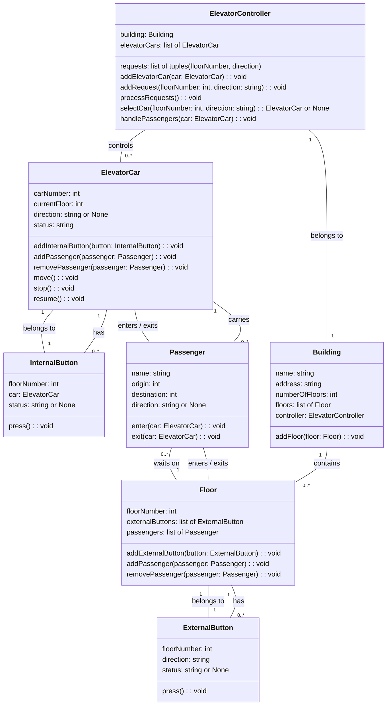

```
Elevator design:

ElevatorCar: Represents an elevator car that moves between floors and carries passengers. It has attributes such as carNumber, currentFloor, direction, status, internalButtons and passengers. It has behaviors such as addInternalButton, addPassenger, removePassenger, move, stop and resume.
ElevatorController: Represents an elevator controller that controls the movement of the elevator cars and handles the requests from the floors. It has attributes such as building, elevatorCars and requests. It has behaviors such as addElevatorCar, addRequest, processRequests, selectCar and handlePassengers.
Floor: Represents a floor in the building that has external buttons and passengers waiting for the elevator. It has attributes such as floorNumber, externalButtons and passengers. It has behaviors such as addExternalButton, addPassenger and removePassenger.
InternalButton: Represents an internal button inside an elevator car that allows passengers to select their destination floor. It has attributes such as floorNumber, car and status. It has a behavior such as press.
ExternalButton: Represents an external button on a floor that allows passengers to request an elevator in a certain direction. It has attributes such as floorNumber, direction and status. It has a behavior such as press.
Building: Represents a building that contains floors and an elevator controller. It has attributes such as name, address, numberOfFloors, floors and controller. It has a behavior such as addFloor.
Passenger: Represents a person who uses the elevator system to go from one floor to another. It has attributes such as name, origin, destination and direction. It has behaviors such as enter and exit.

```


