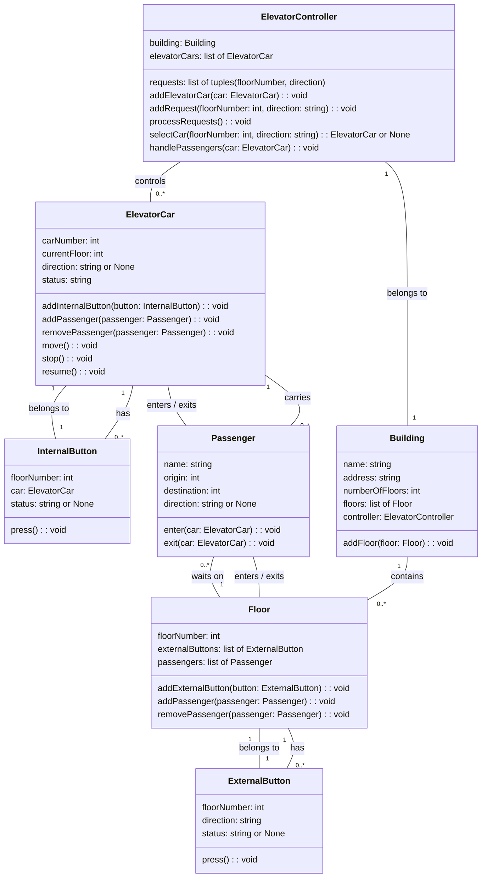

```mermaid
classDiagram
    ElevatorCar "1" -- "0..*" InternalButton : has
    ElevatorCar "1" -- "0..*" Passenger : carries
    ElevatorController "1" -- "0..*" ElevatorCar : controls
    ElevatorController "1" -- "1" Building : belongs to
    Floor "1" -- "0..*" ExternalButton : has
    Floor "1" -- "0..*" Passenger : waits on
    Building "1" -- "0..*" Floor : contains
    InternalButton "1" -- "1" ElevatorCar : belongs to
    ExternalButton "1" -- "1" Floor : belongs to
    Passenger -- ElevatorCar : enters / exits 
    Passenger -- Floor : enters / exits 
    
    class ElevatorCar {
        carNumber: int
        currentFloor: int
        direction: string or None
        status: string
        addInternalButton(button: InternalButton): void
        addPassenger(passenger: Passenger): void
        removePassenger(passenger: Passenger): void
        move(): void
        stop(): void
        resume(): void
    }
    class ElevatorController {
        building: Building
        elevatorCars: list of ElevatorCar
        requests: list of tuples (floorNumber, direction)
        addElevatorCar(car: ElevatorCar): void
        addRequest(floorNumber: int, direction: string): void
        processRequests(): void
        selectCar(floorNumber: int, direction: string): ElevatorCar or None
        handlePassengers(car: ElevatorCar): void 
    }
    class Floor {
        floorNumber: int
        externalButtons: list of ExternalButton
        passengers: list of Passenger
        addExternalButton(button: ExternalButton): void
        addPassenger(passenger: Passenger): void
        removePassenger(passenger: Passenger): void
    }
    class InternalButton {
        floorNumber: int
        car: ElevatorCar
        status: string or None
        press(): void 
    }
    class ExternalButton {
        floorNumber: int
        direction: string
        status: string or None
        press(): void 
    }
    class Building {
        name: string
        address: string
        numberOfFloors: int
        floors: list of Floor
        controller: ElevatorController
        addFloor(floor: Floor): void
    }
    class Passenger {
        name: string
        origin: int
        destination: int
        direction: string or None
        enter(car: ElevatorCar): void
        exit(car: ElevatorCar): void 
    }
```