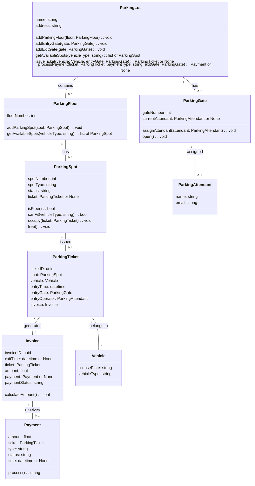

```mermaid
classDiagram
  ParkingLot "1" -- "0..*" ParkingFloor : contains
  ParkingLot "1" -- "0..*" ParkingGate : has
  ParkingFloor "1" -- "0..*" ParkingSpot : has
  ParkingGate "1" -- "0..1" ParkingAttendant : assigned
  ParkingSpot "1" -- "0..*" ParkingTicket : issued
  ParkingTicket "1" -- "1" Invoice : generates
  ParkingTicket "1" -- "1" Vehicle : belongs to
  Invoice "1" -- "0..1" Payment : receives
  class ParkingLot {
    name: string
    address: string
    addParkingFloor(floor: ParkingFloor): void
    addEntryGate(gate: ParkingGate): void
    addExitGate(gate: ParkingGate): void
    getAvailableSpots(vehicleType: string): list of ParkingSpot
    issueTicket(vehicle: Vehicle, entryGate: ParkingGate): ParkingTicket or None
    processPayment(ticket: ParkingTicket, paymentType: string, exitGate: ParkingGate): Payment or None
  }
  class ParkingFloor {
    floorNumber: int
    addParkingSpot(spot: ParkingSpot): void
    getAvailableSpots(vehicleType: string): list of ParkingSpot
  }
  class ParkingSpot {
    spotNumber: int
    spotType: string
    status: string
    ticket: ParkingTicket or None
    isFree(): bool
    canFit(vehicleType: string): bool
    occupy(ticket: ParkingTicket): void
    free(): void
  }
  class ParkingTicket {
    ticketID: uuid
    spot: ParkingSpot
    vehicle: Vehicle
    entryTime: datetime
    entryGate: ParkingGate
	entryOperator: ParkingAttendant
    invoice: Invoice
  }
  class Invoice {
    invoiceID: uuid
    exitTime: datetime or None
    ticket: ParkingTicket
    amount: float
    payment: Payment or None
    paymentStatus: string
    calculateAmount(): float
  }
  class Payment {
    amount: float
    ticket: ParkingTicket
    type: string
    status: string
    time: datetime or None
    process(): string 
  }
  class Vehicle {
    licensePlate: string
    vehicleType: string
  }
  class ParkingGate {
    gateNumber: int
    currentAttendant: ParkingAttendant or None
    assignAttendant(attendant: ParkingAttendant): void
    open(): void
  }
  class ParkingAttendant {
    name: string
    email: string
  }
```
  