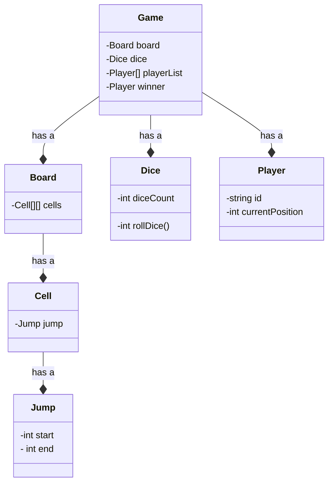

# Code for Snakes and Ladders

# Basically in Python programming the code is written 

# Writing class diagram of snakes and ladder

```mermaid

classDiagram

    class Game{
        -Board board
        -Dice dice
        -Player[] playerList
        -Player winner
    }
    Game --* Board : has a
    Game --* Dice : has a
    Game --* Player : has a

    class Board{
        -Cell[][] cells
   }
   Board --* Cell : has a

   class Dice{
    -int diceCount
    -int rollDice()
   }

   class Player{
    -string id
    -int currentPosition
   }

   class Jump{
    -int start
    - int end
   }

   class Cell{
    -Jump jump
   }
   Cell --* Jump : has a

```